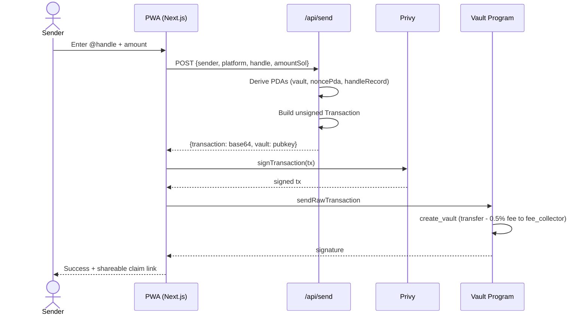
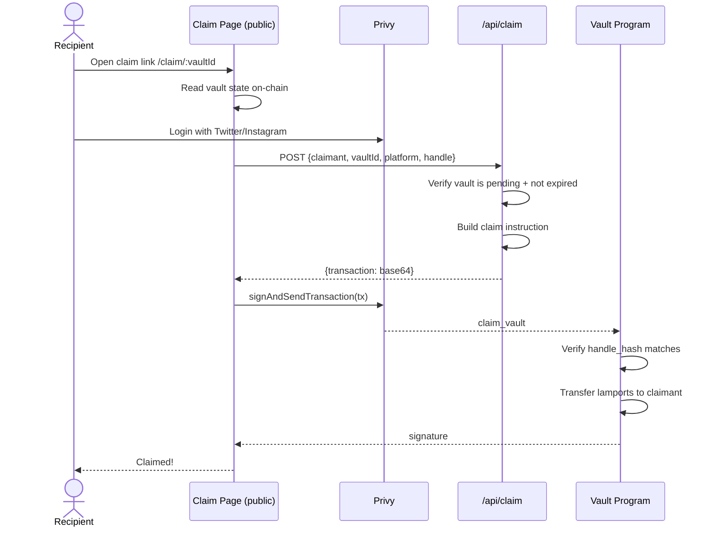

# Pay on @ — Paga no @

> Send SOL and USDC to any Instagram, X (Twitter), or WhatsApp handle. No wallet required to receive.

Built for the **Colosseum Frontier Hackathon**

---

## Overview

**Pay on @** solves a fundamental UX problem in crypto payments: the recipient needs a wallet address. With Pay on @, the sender only needs the recipient's social media handle — the funds sit in a 7-day escrow vault on Solana until the recipient claims them (with or without a pre-existing wallet), or the sender gets a full refund.

```
Sender                          Protocol                        Recipient (@handle)
  │                               │                                │
  │── send 10 USDC → @alice ──►   │                                │
  │                               │── PaymentVault created         │
  │                               │   (7-day escrow)               │
  │                               │                                │
  │                               │   @alice receives claim link   │
  │                               │◄──────────────────────────────►│
  │                               │                                │
  │                               │◄── claim (verify Twitter auth)─┤
  │                               │                                │
  │                               │── funds released to @alice     │
```

---

## Architecture

### System Overview


### Send Flow



### Claim Flow



---

## Programs

### Registry (`AT8S64nJohSwwAv4BxfvAxwaWaVnfFvfsVXVjA8DZkvX`)

Maps social handles to destination wallets. Handles are SHA-256 hashed before storing — no plaintext on-chain.

| Instruction | Description |
|---|---|
| `initialize_config` | One-time setup, sets authority |
| `register_handle` | Register `(platform, handle) → wallet` mapping |
| `update_wallet` | Owner updates their destination wallet |
| `verify_handle` | Authority marks a handle as verified |

**HandleRecord PDA seeds:** `["handle", platform_u8, sha256(normalized_handle)]`

### Vault (`EgS854XfeyTkuTKpYzDD3h5kiKMt4h3J37hGaBfuDN4H`)

Manages 7-day payment escrows with per-sender nonces.

| Instruction | Description |
|---|---|
| `initialize_config` | Set fee_bps (default 50 = 0.5%), claim_period, authority |
| `create_vault` | Deposit SOL/USDC into escrow; deducts fee to FeeCollector |
| `claim_vault` | Recipient claims by proving handle ownership |
| `refund_vault` | Sender reclaims after expiry |

**PaymentVault PDA seeds:** `["vault", sender_pubkey, nonce_u64_le]`
**SenderNonce PDA seeds:** `["nonce", sender_pubkey]`

**VaultStatus enum:** `Pending(0)` → `Claimed(1)` or `Refunded(2)` or `Expired(3)`

### Fee Collector (`CxMBNwbovsvLTe7bSuca8X26WS7PW81VtDu3oLyfSG6s`)

Accumulates protocol fees (0.5% of each transfer). Authority can withdraw.

| Instruction | Description |
|---|---|
| `initialize` | Create the treasury PDA |
| `withdraw_sol` | Withdraw accumulated SOL |
| `withdraw_spl` | Withdraw accumulated SPL tokens |

---

## Account Layouts

### PaymentVault (bytes after 8-byte Anchor discriminator)

```
sender:                 Pubkey  [32]
recipient_handle_hash:  [u8;32] [32]
recipient_platform:     u8      [1]
amount:                 u64     [8]
mint:                   Pubkey  [32]
status:                 u8      [1]   (0=Pending, 1=Claimed, 2=Refunded, 3=Expired)
created_at:             i64     [8]
expires_at:             i64     [8]
claimed_at:             Option<i64> [1+8]
vault_nonce:            u64     [8]
bump:                   u8      [1]
```

### HandleRecord (bytes after 8-byte discriminator)

```
platform:           u8      [1]   (0=Instagram, 1=Twitter, 2=WhatsApp)
handle_hash:        [u8;32] [32]
owner:              Pubkey  [32]
destination_wallet: Pubkey  [32]
verified:           bool    [1]
created_at:         i64     [8]
updated_at:         i64     [8]
bump:               u8      [1]
```

---

## Frontend

**Stack:** Next.js 14 App Router · TailwindCSS · Framer Motion · React Query · Privy

**Pages:**
- `/` — Landing/onboarding, social login CTA
- `/wallet` — Dashboard: balance (SOL + USD + BRL), quick actions, history
- `/send` — 4-step send flow: handle → amount → confirm (shows fee) → success
- `/claim/:vaultId` — Public claim page (no auth required to view, auth to claim)
- `/defi` — DeFi yield strategies hub (Kamino, Sanctum, Orca)
- `/settings` — Profile, linked accounts, wallet address, logout

**Auth:** Privy embedded wallets — users sign in with Google/Apple/Twitter/email. A Solana wallet is automatically created if they don't have one.

---

## SDK (`@pay-on-handle/sdk`)

```typescript
import { buildCreateVaultTx, buildClaimVaultTx, fetchVault, hashHandle } from "@pay-on-handle/sdk";
import { Connection, PublicKey } from "@solana/web3.js";

const connection = new Connection("https://api.devnet.solana.com");

// Build a send transaction
const { transaction, vault, netAmount, feeAmount } = await buildCreateVaultTx({
  connection,
  sender: new PublicKey("..."),
  platform: 1, // Twitter
  handle: "@alice",
  amountLamports: 1_000_000_000n, // 1 SOL
});

// Read vault state
const vaultData = await fetchVault(connection, vault);
console.log(vaultData?.status); // "pending"

// Build a claim transaction
const claimTx = await buildClaimVaultTx({
  connection,
  claimant: new PublicKey("..."),
  vault,
  platform: 1,
  handle: "@alice",
  mint: new PublicKey("So11111111111111111111111111111111111111112"),
});
```

---

## Getting Started

### Prerequisites

- Rust + Solana CLI (`1.18+`)
- Anchor CLI (`0.32.0`)
- Node.js 20+ / Bun
- A funded devnet wallet (`solana airdrop 2`)

### Build Programs

```bash
anchor build
```

### Run Tests

```bash
anchor test
```

### Deploy to Devnet

```bash
anchor deploy --provider.cluster devnet
```

### Run the Frontend

```bash
cd app
cp .env.example .env.local
# Fill in NEXT_PUBLIC_PRIVY_APP_ID and NEXT_PUBLIC_RPC_ENDPOINT
npm install
npm run dev
```

---

## Environment Variables

```bash
# app/.env.local
NEXT_PUBLIC_PRIVY_APP_ID=your_privy_app_id
NEXT_PUBLIC_RPC_ENDPOINT=https://devnet.helius-rpc.com/?api-key=YOUR_KEY
NEXT_PUBLIC_APP_URL=http://localhost:3000

# Relayer keypair (base58) — pays for on-chain register_handle txs
RELAYER_PRIVATE_KEY=base58_encoded_key

# Privy server-side JWT verification
PRIVY_APP_SECRET=your_privy_app_secret

# Helius
HELIUS_API_KEY=your_helius_key
HELIUS_WEBHOOK_SECRET=your_webhook_secret

# PIX off-ramp (future)
OPENPIX_APP_ID=your_openpix_key
BRLA_API_KEY=your_brla_key

# Instagram OAuth (future)
META_APP_ID=your_meta_app_id
META_APP_SECRET=your_meta_app_secret
META_REDIRECT_URI=https://your-domain.com/api/auth/instagram/callback

# Redis (required for PIX store persistence)
UPSTASH_REDIS_REST_URL=https://xxx.upstash.io
UPSTASH_REDIS_REST_TOKEN=your_token
```

---

## Deployment

### Option A — Vercel (recommended for frontend)

Vercel is the simplest path: connect your GitHub repo and Vercel handles the build automatically.

**Requirements before deploying:**
- `output: 'standalone'` is already set in `next.config.mjs` ✅
- All `NEXT_PUBLIC_*` env vars must be set in Vercel dashboard
- Server-only env vars (`RELAYER_PRIVATE_KEY`, `HELIUS_API_KEY`, etc.) are set as non-public variables
- Add **Upstash Redis** integration (free tier) for PIX store persistence

**Steps:**
1. Push the `app/` directory (or the full repo) to GitHub
2. Import the repo in [vercel.com/new](https://vercel.com/new)
3. Set **Root Directory** to `pay-on-handle/app`
4. Add all environment variables under *Settings → Environment Variables*
5. Deploy

**Limitation:** Vercel serverless functions are stateless — `pix-store.ts` (in-memory `Map`) loses state between requests. Migrate to Upstash Redis before enabling PIX.

---

### Option B — Railway (full Docker deploy)

Railway runs a persistent Node.js container, making it simpler for stateful use cases.

**`next.config.mjs`** already has `output: 'standalone'` ✅

**Create `app/Dockerfile`:**

```dockerfile
FROM node:20-alpine AS builder
WORKDIR /app
COPY package*.json ./
RUN npm ci
COPY . .
RUN npm run build

FROM node:20-alpine AS runner
WORKDIR /app
ENV NODE_ENV=production
ENV PORT=3000
COPY --from=builder /app/.next/standalone ./
COPY --from=builder /app/.next/static ./.next/static
COPY --from=builder /app/public ./public
EXPOSE 3000
CMD ["node", "server.js"]
```

**Steps:**
1. Go to [railway.app](https://railway.app) → New Project → Deploy from GitHub Repo
2. Select your repo; set **Root Directory** to `pay-on-handle/app`
3. Railway auto-detects Next.js — or point it to the Dockerfile above
4. Add a **Redis** service inside the same Railway project (for PIX store)
5. Add all environment variables in *Variables* tab (Railway auto-injects `REDIS_URL`)
6. Set `NEXT_PUBLIC_APP_URL` to your Railway-generated URL (e.g. `https://pay-on-handle-production-70a5.up.railway.app`)
7. Deploy

**Environment variables for Railway:**

```bash
# Public (exposed to browser)
NEXT_PUBLIC_PRIVY_APP_ID=cmo0pavcd00860cjp0engxymy
NEXT_PUBLIC_RPC_ENDPOINT=https://devnet.helius-rpc.com/?api-key=YOUR_KEY
NEXT_PUBLIC_VAULT_PROGRAM_ID=EgS854XfeyTkuTKpYzDD3h5kiKMt4h3J37hGaBfuDN4H
NEXT_PUBLIC_REGISTRY_PROGRAM_ID=AT8S64nJohSwwAv4BxfvAxwaWaVnfFvfsVXVjA8DZkvX
NEXT_PUBLIC_FEE_COLLECTOR_PROGRAM_ID=CxMBNwbovsvLTe7bSuca8X26WS7PW81VtDu3oLyfSG6s
NEXT_PUBLIC_APP_URL=https://pay-on-handle-production-70a5.up.railway.app

# Server-only
RELAYER_PRIVATE_KEY=<bs58 keypair — keep secret>
PRIVY_APP_SECRET=<from Privy dashboard → API Keys>
HELIUS_API_KEY=e657af06-55cf-4b04-bb72-09909232d6c4
HELIUS_WEBHOOK_SECRET=<generate and set in Helius dashboard>
OPENPIX_APP_ID=<Woovi — pending>
REDIS_URL=<auto-injected by Railway Redis service>
```

---

## Security Model

| Threat | Mitigation |
|---|---|
| Wrong recipient claims | `claim_vault` verifies SHA-256 of handle matches stored hash |
| Double claim | Status transitions: `Pending → Claimed` (immutable after) |
| Sender griefing | 7-day claim window; refund only after expiry |
| Fee manipulation | Fee bps stored in `VaultConfig` PDA, only authority can update |
| Overflow/underflow | All arithmetic uses `checked_add`, `checked_sub`, `checked_mul` |
| PDA substitution | Seeds include sender pubkey + nonce; canonical bump stored |
| Re-initialization | `init` not `init_if_needed` for VaultConfig and FeeCollector |
| Arbitrary CPI | All CPI targets validated via `Program<'info, T>` constraints |

---

## Roadmap

### Phase 1 — Devnet Live (current sprint)

- [x] On-chain programs (Registry, Vault, FeeCollector)
- [x] Next.js 14 PWA (send, claim, wallet, DeFi, settings)
- [x] TypeScript SDK
- [x] `next build` passing, `output: standalone`
- [ ] Initialize VaultConfig PDA on devnet
- [ ] Configure Helius webhook → `/api/webhooks/helius`
- [ ] Twitter OAuth enabled in Privy dashboard
- [ ] Handle registration onboarding flow (auto-register after OAuth)
- [ ] Real wallet activity history via Helius `getTransactionHistory`

### Phase 2 — PIX Off-ramp

- [ ] Migrate `pix-store.ts` from in-memory `Map` to Redis (Upstash/Railway)
- [ ] Integrate OpenPix/Woovi API for PIX dispatch
- [ ] Jupiter swap: SOL → USDC on claim (before PIX conversion)
- [ ] BRLA Digital integration for BRL stablecoin path

### Phase 3 — Instagram + Program Hardening

- [ ] Instagram OAuth via Meta Graph API (`/api/auth/instagram/callback`)
- [ ] Close vault PDAs after claim/refund (recover ~0.002 SOL rent)
- [ ] Mint whitelist on `create_spl_vault` (accept only USDC)
- [ ] ZK proof of handle ownership (replace MVP stub in Registry)

### Phase 4 — DeFi + Cross-Chain

- [ ] Kamino yield vault — idle escrow earns yield while waiting for claim
- [ ] Orca/Meteora LP integration
- [ ] Ika cross-chain bridgeless deposits
- [ ] Push notifications via Helius webhooks

---

## License

MIT — © 2025 Superteam Brazil
