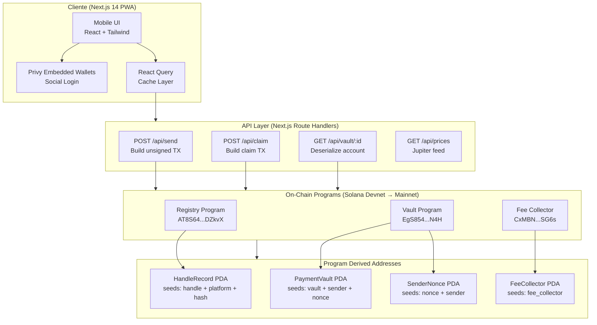
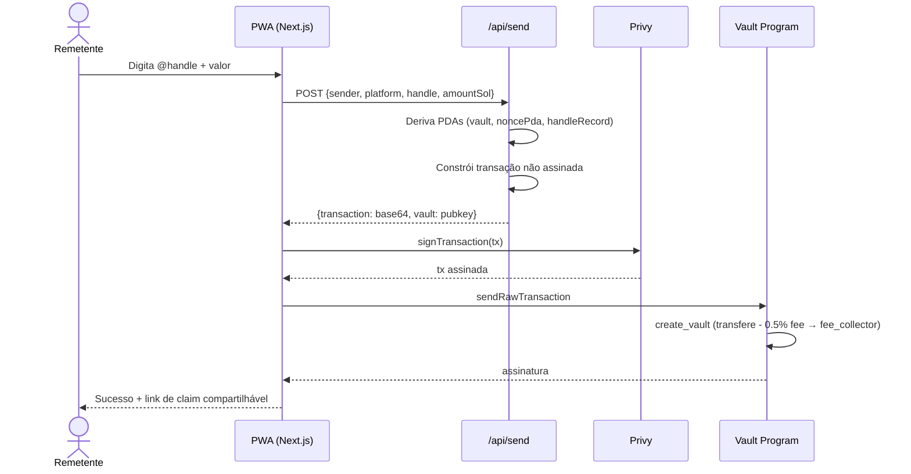
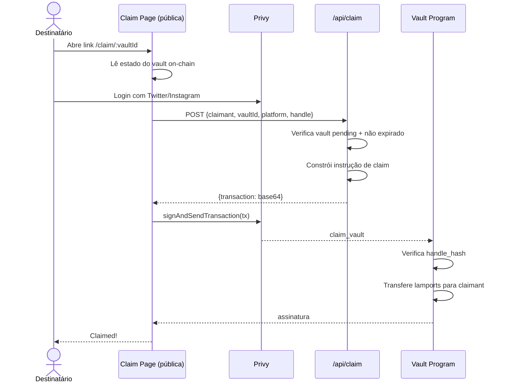

# Paga no @ — Pay on Handle

> Envie SOL e USDC para qualquer Instagram, X (Twitter) ou WhatsApp. Sem wallet necessária para receber.

**Construído para o Colosseum Frontier Hackathon · Superteam Brazil**

---

## Visão Geral

**Paga no @** resolve um problema fundamental de UX em pagamentos cripto: o destinatário precisa de um endereço de wallet. Com o Pay on @, o remetente só precisa do @handle de rede social — os fundos ficam em escrow por 7 dias num vault Solana até o destinatário fazer o claim (com ou sem wallet pré-existente), ou o remetente recebe reembolso total.

```
Remetente                       Protocolo                      Destinatário (@handle)
  │                               │                                │
  │── envia 10 USDC → @alice ──►  │                                │
  │                               │── PaymentVault criado          │
  │                               │   (escrow 7 dias)              │
  │                               │                                │
  │                               │   @alice recebe link de claim  │
  │                               │◄──────────────────────────────►│
  │                               │                                │
  │                               │◄── claim (verifica Twitter) ───┤
  │                               │                                │
  │                               │── fundos liberados para @alice │
```

---

## Arquitetura

### Visão do Sistema



### Fluxo de Envio



### Fluxo de Claim



---

## Programas

### Registry (`AT8S64nJohSwwAv4BxfvAxwaWaVnfFvfsVXVjA8DZkvX`)

Mapeia handles sociais para wallets destino. Handles são SHA-256 hasheados antes de armazenar — nenhum texto em claro on-chain.

| Instrução | Descrição |
|---|---|
| `initialize_config` | Setup único, define authority |
| `register_handle` | Registra `(platform, handle) → wallet` |
| `update_wallet` | Owner atualiza wallet destino |
| `verify_handle` | Authority marca handle como verificado |

**Seeds do HandleRecord PDA:** `["handle", platform_u8, sha256(normalized_handle)]`

### Vault (`EgS854XfeyTkuTKpYzDD3h5kiKMt4h3J37hGaBfuDN4H`)

Gerencia escrow de pagamentos de 7 dias com nonces por remetente.

| Instrução | Descrição |
|---|---|
| `initialize_config` | Define fee_bps (padrão 50 = 0.5%), claim_period, authority |
| `create_vault` | Deposita SOL/USDC em escrow; deduz taxa para FeeCollector |
| `claim_vault` | Destinatário faz claim provando posse do handle |
| `refund_vault` | Remetente recupera após expiração |

**Seeds do PaymentVault PDA:** `["vault", sender_pubkey, nonce_u64_le]`  
**Seeds do SenderNonce PDA:** `["nonce", sender_pubkey]`

**Enum VaultStatus:** `Pending(0)` → `Claimed(1)` ou `Refunded(2)` ou `Expired(3)`

### Fee Collector (`CxMBNwbovsvLTe7bSuca8X26WS7PW81VtDu3oLyfSG6s`)

Acumula taxas do protocolo (0.5% de cada transferência). Authority pode sacar.

| Instrução | Descrição |
|---|---|
| `initialize` | Cria o PDA de treasury |
| `withdraw_sol` | Saca SOL acumulado |
| `withdraw_spl` | Saca tokens SPL acumulados |

---

## Layout de Contas

### PaymentVault (bytes após discriminador Anchor de 8 bytes)

```
sender:                 Pubkey  [32]
recipient_handle_hash:  [u8;32] [32]
recipient_platform:     u8      [1]
amount:                 u64     [8]
mint:                   Pubkey  [32]
status:                 u8      [1]   (0=Pending, 1=Claimed, 2=Refunded, 3=Expired)
created_at:             i64     [8]
expires_at:             i64     [8]
claimed_at:             Option<i64> [1+8]
vault_nonce:            u64     [8]
bump:                   u8      [1]
```

### HandleRecord (bytes após discriminador de 8 bytes)

```
platform:           u8      [1]   (0=Instagram, 1=Twitter, 2=WhatsApp)
handle_hash:        [u8;32] [32]
owner:              Pubkey  [32]
destination_wallet: Pubkey  [32]
verified:           bool    [1]
created_at:         i64     [8]
updated_at:         i64     [8]
bump:               u8      [1]
```

---

## Frontend

**Stack:** Next.js 14 App Router · TailwindCSS · Framer Motion · React Query · Privy

**Páginas:**
- `/` — Landing institucional, explica o protocolo, CTA de login
- `/wallet` — Dashboard: saldo (SOL + USD + BRL), ações rápidas, histórico
- `/send` — Fluxo de 4 passos: handle → valor → confirmar (mostra taxa) → sucesso
- `/claim/:vaultId` — Página pública de claim (não requer auth para ver, requer para claimar)
- `/defi` — Hub de estratégias DeFi (Kamino, Sanctum, Orca)
- `/settings` — Perfil, contas vinculadas, endereço da wallet, logout

**Auth:** Privy embedded wallets — usuários entram com Google/Apple/Twitter/email. Uma wallet Solana é criada automaticamente se não tiverem uma.

---

## SDK (`@pay-on-handle/sdk`)

```typescript
import { buildCreateVaultTx, buildClaimVaultTx, fetchVault, hashHandle } from "@pay-on-handle/sdk";
import { Connection, PublicKey } from "@solana/web3.js";

const connection = new Connection("https://api.devnet.solana.com");

// Construir transação de envio
const { transaction, vault, netAmount, feeAmount } = await buildCreateVaultTx({
  connection,
  sender: new PublicKey("..."),
  platform: 1, // Twitter
  handle: "@alice",
  amountLamports: 1_000_000_000n, // 1 SOL
});

// Ler estado do vault
const vaultData = await fetchVault(connection, vault);
console.log(vaultData?.status); // "pending"

// Construir transação de claim
const claimTx = await buildClaimVaultTx({
  connection,
  claimant: new PublicKey("..."),
  vault,
  platform: 1,
  handle: "@alice",
  mint: new PublicKey("So11111111111111111111111111111111111111112"),
});
```

---

## Começando

### Pré-requisitos

- Rust + Solana CLI (`1.18+`)
- Anchor CLI (`0.32.0`)
- Node.js 20+ / Bun
- Wallet devnet com fundos (`solana airdrop 2`)

### Build dos Programas

```bash
anchor build
```

### Executar Testes

```bash
anchor test
```

### Deploy para Devnet

```bash
anchor deploy --provider.cluster devnet
```

### Executar o Frontend

```bash
cd app
cp .env.example .env.local
# Preencha NEXT_PUBLIC_PRIVY_APP_ID e NEXT_PUBLIC_RPC_ENDPOINT
npm install
npm run dev
```

---

## Variáveis de Ambiente

```bash
# app/.env.local
NEXT_PUBLIC_PRIVY_APP_ID=seu_privy_app_id
NEXT_PUBLIC_RPC_ENDPOINT=https://devnet.helius-rpc.com/?api-key=SUA_KEY
NEXT_PUBLIC_APP_URL=http://localhost:3000

# Keypair do relayer (base58) — paga por txs on-chain de register_handle
RELAYER_PRIVATE_KEY=chave_base58_encoded

# Verificação JWT server-side do Privy
PRIVY_APP_SECRET=seu_privy_app_secret

# Helius
HELIUS_API_KEY=sua_helius_key
HELIUS_WEBHOOK_SECRET=seu_webhook_secret

# PIX off-ramp (futuro)
OPENPIX_APP_ID=sua_openpix_key
BRLA_API_KEY=sua_brla_key

# Instagram OAuth (futuro)
META_APP_ID=seu_meta_app_id
META_APP_SECRET=seu_meta_app_secret
META_REDIRECT_URI=https://seu-dominio.com/api/auth/instagram/callback

# Redis (necessário para persistência do PIX store)
UPSTASH_REDIS_REST_URL=https://xxx.upstash.io
UPSTASH_REDIS_REST_TOKEN=seu_token
```

---

## Deploy

### Opção A — Vercel (recomendado para frontend)

Vercel é o caminho mais simples: conecte seu repositório GitHub e o Vercel cuida do build automaticamente.

**Requisitos antes do deploy:**
- `output: 'standalone'` já está configurado em `next.config.mjs` ✅
- Todas as variáveis `NEXT_PUBLIC_*` devem estar no painel do Vercel
- Variáveis server-only (`RELAYER_PRIVATE_KEY`, `HELIUS_API_KEY`, etc.) como variáveis não-públicas
- Adicionar integração **Upstash Redis** (tier gratuito) para persistência do PIX store

**Passos:**
1. Push do diretório `app/` (ou repo completo) para o GitHub
2. Importe o repo em [vercel.com/new](https://vercel.com/new)
3. Defina **Root Directory** como `pay-on-handle/app`
4. Adicione todas as variáveis de ambiente em *Settings → Environment Variables*
5. Deploy

---

### Opção B — Railway (deploy Docker completo)

Railway executa um container Node.js persistente, ideal para casos de uso com estado.

**`next.config.mjs`** já tem `output: 'standalone'` ✅

**Crie `app/Dockerfile`:**

```dockerfile
FROM node:20-alpine AS builder
WORKDIR /app
COPY package*.json ./
RUN npm ci
COPY . .
RUN npm run build

FROM node:20-alpine AS runner
WORKDIR /app
ENV NODE_ENV=production
ENV PORT=3000
COPY --from=builder /app/.next/standalone ./
COPY --from=builder /app/.next/static ./.next/static
COPY --from=builder /app/public ./public
EXPOSE 3000
CMD ["node", "server.js"]
```

**Passos:**
1. Acesse [railway.app](https://railway.app) → New Project → Deploy from GitHub Repo
2. Selecione o repo; defina **Root Directory** como `pay-on-handle/app`
3. Railway detecta Next.js automaticamente
4. Adicione um serviço **Redis** no mesmo projeto Railway
5. Adicione todas as variáveis de ambiente na aba *Variables*
6. Defina `NEXT_PUBLIC_APP_URL` para a URL gerada pelo Railway
7. Deploy

---

## Modelo de Segurança

| Ameaça | Mitigação |
|---|---|
| Claim errado de destinatário | `claim_vault` verifica SHA-256 do handle com hash armazenado |
| Double claim | Transições de status: `Pending → Claimed` (imutável depois) |
| Sender griefing | Janela de 7 dias; reembolso só após expiração |
| Manipulação de fee | Fee bps armazenado em PDA `VaultConfig`, só authority atualiza |
| Overflow/underflow | Toda aritmética usa `checked_add`, `checked_sub`, `checked_mul` |
| PDA substitution | Seeds incluem sender pubkey + nonce; canonical bump armazenado |
| Re-inicialização | `init` em vez de `init_if_needed` para VaultConfig e FeeCollector |
| CPI arbitrário | Todos os targets de CPI validados via `Program<'info, T>` |

---

## Roadmap

### Fase 1 — Devnet Live (sprint atual)

- [x] Programas on-chain (Registry, Vault, FeeCollector)
- [x] Next.js 14 PWA (send, claim, wallet, DeFi, settings)
- [x] TypeScript SDK
- [x] Landing page institucional
- [x] `next build` passando, `output: standalone`
- [ ] Inicializar VaultConfig PDA no devnet
- [ ] Configurar webhook Helius → `/api/webhooks/helius`
- [ ] Twitter OAuth habilitado no painel do Privy
- [ ] Fluxo de onboarding de registro de handle (auto-register após OAuth)
- [ ] Histórico real de atividade via Helius `getTransactionHistory`

### Fase 2 — Off-ramp PIX

- [ ] Migrar `pix-store.ts` de `Map` in-memory para Redis (Upstash/Railway)
- [ ] Integrar API OpenPix/Woovi para despacho de PIX
- [ ] Jupiter swap: SOL → USDC no claim (antes da conversão PIX)
- [ ] Integração BRLA Digital para caminho de stablecoin BRL

### Fase 3 — Instagram + Hardening dos Programas

- [ ] Instagram OAuth via Meta Graph API (`/api/auth/instagram/callback`)
- [ ] Fechar vault PDAs após claim/refund (recuperar ~0.002 SOL de rent)
- [ ] Whitelist de mints em `create_spl_vault` (aceitar só USDC)
- [ ] Prova ZK de posse de handle (substituir MVP stub no Registry)

### Fase 4 — DeFi + Cross-Chain

- [ ] Vault de yield Kamino — escrow ocioso rende yield enquanto aguarda claim
- [ ] Integração Orca/Meteora LP
- [ ] Depósitos cross-chain bridgeless via Ika
- [ ] Push notifications via webhooks Helius

---

## Licença

MIT — © 2025 Superteam Brazil
